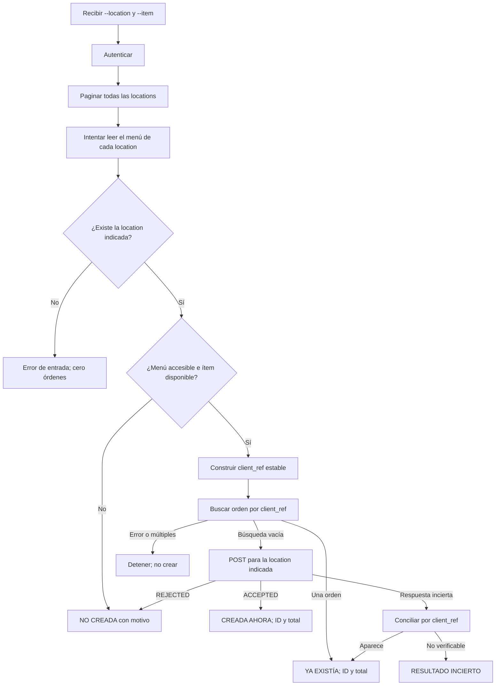
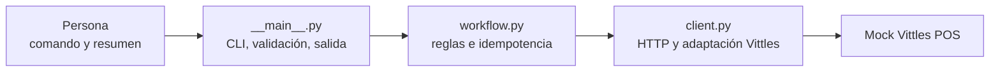

# Diseño de salida por consola — integración Vittles POS

**Estado:** boceto histórico anterior a la implementación. El comando vigente es `php artisan vittles:order <location> "<item>"` desde `app/`. Las páginas web ya están implementadas y se describen en [DISENO_PAGINAS.md](DISENO_PAGINAS.md). Los IDs de orden pueden variar.  
**Alcance:** una CLI que lee todas las locations y sus menús, y crea **como máximo una orden por ejecución**, solo en la location indicada con `--location`.

## 1. Concepto de la experiencia

La persona ejecuta un comando con dos datos obligatorios: **sede** y **nombre exacto del producto**. La herramienta hace la exploración completa que pide la consigna y presenta al final un resumen corto centrado en la sede elegida. Las sedes no seleccionadas se leen, pero **nunca reciben una orden**.

La salida debe contestar en este orden:

1. ¿Qué pedido se intentó y en qué sede?
2. ¿Se consultaron todas las sedes y menús? ¿Hubo advertencias?
3. ¿La orden se creó ahora, ya existía o no pudo crearse?
4. Si existe, ¿cuál es su ID y total?
5. Si no hay certeza, ¿qué referencia sirve para conciliar sin duplicar?

No propongo una pantalla web: agrega instalación y superficie de error a un ejercicio cuyo entregable es una integración pequeña ejecutable por comando.

## 2. Contrato de entrada

```text
py -3 -m vittles_pos --location <LOCATION_ID> --item "<NOMBRE_EXACTO>" [--batch-id <LOTE>]
```

| Argumento | Uso | Decisión |
| --- | --- | --- |
| `--location` | Obligatorio | ID exacto, por ejemplo `loc_1001`. Evita nombres ambiguos. |
| `--item` | Obligatorio | Nombre exacto tras quitar espacios externos. No se elige automáticamente un producto parecido. |
| `--batch-id` | Opcional | Un valor demo estable permite repetir el mismo comando sin duplicar. Cambiarlo expresa una nueva intención de compra. |
| `--base-url` | Opcional | Por defecto `http://127.0.0.1:8422` para el mock. |
| Credenciales | Variables de entorno | `VITTLES_CLIENT_ID` y `VITTLES_CLIENT_SECRET`; no se imprimen. |

La cantidad queda fija en **2**, como pide la consigna; no se agrega `--quantity` al ejercicio. El comando para Windows usa `py -3` porque aquí funciona ese lanzador; en un entorno con `python3` sería equivalente.

### Mockup de ayuda

```text
> py -3 -m vittles_pos --help

Uso: vittles_pos --location ID --item NOMBRE [--batch-id LOTE]

  --location ID      Sede donde se intentará crear la única orden.
  --item NOMBRE      Nombre exacto del producto en el menú de esa sede.
  --batch-id LOTE    Identifica el pedido. Repetirlo evita duplicados.
  --base-url URL     API Vittles; por defecto http://127.0.0.1:8422.

Ejemplo:
  py -3 -m vittles_pos --location loc_1001 --item "Buffalo Wings (12)"
```

## 3. Mockups de la salida

### A. Primera ejecución: orden creada

```text
> py -3 -m vittles_pos --location loc_1001 --item "Buffalo Wings (12)"

VITTLES POS · RESUMEN
Pedido       Buffalo Wings (12) × 2
Sede         loc_1001 · Vittles Demo - Midtown
Exploración  5 locations · 5 menús intentados · 4 obtenidos
Aviso        loc_1004: menú sin acceso (403)

Orden        CREADA AHORA
ID           ord_5501
Total        USD 31.00
```

Se muestra el aviso de `loc_1004` porque la lectura completa es parte del ejercicio. El aviso **no** convierte la orden de `loc_1001` en fallo. El total visible viene de la respuesta de la orden aceptada, no de una multiplicación local.

### B. Segunda ejecución: misma orden, sin otro POST

```text
> py -3 -m vittles_pos --location loc_1001 --item "Buffalo Wings (12)"

VITTLES POS · RESUMEN
Pedido       Buffalo Wings (12) × 2
Sede         loc_1001 · Vittles Demo - Midtown
Exploración  5 locations · 5 menús intentados · 4 obtenidos
Aviso        loc_1004: menú sin acceso (403)

Orden        YA EXISTÍA · no se creó otra
ID           ord_5501
Total        USD 31.00
```

El mismo ID es la demostración visual de la idempotencia **secuencial** pedida. Para que sea válida, ambas ejecuciones deben usar el mismo `batch-id` y el mismo proceso del mock.

### C. Producto no disponible en la sede elegida

```text
> py -3 -m vittles_pos --location loc_1005 --item "Buffalo Wings (12)"

VITTLES POS · RESUMEN
Pedido       Buffalo Wings (12) × 2
Sede         loc_1005 · Vittles Demo - Beachside
Exploración  5 locations · 5 menús intentados · 4 obtenidos

Orden        NO CREADA
Motivo       El producto existe, pero no está disponible en esta sede.
Siguiente    Elegí otro producto o sede. No se envió ningún POST de orden.
```

El `403` de `loc_1004` puede figurar como aviso adicional si se desea conservar todo el diagnóstico, pero el motivo principal es la disponibilidad del producto en la sede elegida.

### D. Sede elegida inactiva

```text
> py -3 -m vittles_pos --location loc_1004 --item "Buffalo Wings (12)"

VITTLES POS · RESUMEN
Pedido       Buffalo Wings (12) × 2
Sede         loc_1004 · Vittles Demo - Warehouse (legacy)
Exploración  5 locations · 5 menús intentados · 4 obtenidos

Orden        NO CREADA
Motivo       Vittles no permite consultar el menú de esta sede (403).
Siguiente    Verificá que la sede esté habilitada para el partner.
```

Se intentó consultar el quinto menú. “4 obtenidos” no se presenta como si se hubieran obtenido los cinco.

### E. Resultado incierto después de crear

```text
> py -3 -m vittles_pos --location loc_1001 --item "Buffalo Wings (12)"

VITTLES POS · RESUMEN
Pedido       Buffalo Wings (12) × 2
Sede         loc_1001 · Vittles Demo - Midtown

Orden        RESULTADO INCIERTO
Motivo       Se perdió la respuesta de creación y no fue posible consultar la orden.
Referencia   vt_demo_8c2f19a47bd813eeaf390d7c5c7b2e84
Siguiente    Conciliá esta referencia antes de iniciar otro pedido.
```

Este estado no dice “falló la creación”: la orden **podría existir**. El programa no reenvía el `POST` a ciegas y devuelve un código de salida no exitoso.

### F. Error de entrada

```text
> py -3 -m vittles_pos --location loc_9999 --item "Buffalo Wings (12)"

No se encontró la location "loc_9999".
Locations disponibles: loc_1001, loc_1002, loc_1003, loc_1004, loc_1005.
No se envió ningún POST de orden.
```

Las sugerencias de producto, si se agregan, solo se muestran como ayuda. Nunca disparan una selección automática ni un `POST`.

## 4. Diseño del flujo



La API puede devolver `200` con `REJECTED`, por lo que el flujo mira **código HTTP y cuerpo**. Un `POST` lleva `X-Vittles-Location` igual al ID elegido. Las otras sedes solo aparecen en las lecturas y advertencias.

## 5. Arquitectura: tres cajas



| Archivo | Responsabilidad en una frase |
| --- | --- |
| `__main__.py` | Entender el comando y presentar un resultado legible con el código de salida correcto. |
| `workflow.py` | Decidir si corresponde crear la única orden y qué estado final tiene. |
| `client.py` | Hablar con Vittles y aislar paginación, token, reintentos y formatos inconsistentes. |

No hace falta una UI, una base de datos ni un framework para cumplir este ejercicio. La separación permite probar la lógica de negocio sin levantar el mock y comprobar después el recorrido completo con el servidor real del ZIP.

## 6. Estados y códigos de salida propuestos

| Estado interno | Texto humano | ¿Se hizo POST? | Código de salida |
| --- | --- | --- | ---: |
| `CREATED` | `CREADA AHORA` | Sí | 0 |
| `EXISTING` | `YA EXISTÍA` | No | 0 |
| `SKIPPED` | `NO CREADA` + motivo de negocio | No o rechazo explícito | 2 |
| `FAILED` | `NO CREADA` + error técnico/contrato confirmado | No | 3 |
| `UNKNOWN` | `RESULTADO INCIERTO` | Podría haberse procesado | 4 |

La salida humana es el mínimo de entrega. Un `--json` opcional podría añadirse después para consumo por otro sistema, conservando esos cinco estados y montos como cadenas decimales.

## 7. Prueba visual de aceptación

1. Levantar el mock en una terminal y mantenerlo vivo.
2. Ejecutar el comando para `loc_1001` y `Buffalo Wings (12)`; comprobar `CREADA AHORA`, ID y USD 31.00.
3. Ejecutar **exactamente el mismo comando**; comprobar `YA EXISTÍA`, el mismo ID y USD 31.00.
4. Confirmar que ambas corridas indican cinco locations y cinco intentos de menú.
5. Ejecutar casos separados de sede inactiva e ítem no disponible para comprobar que no se crea una orden inválida.

Los mockups son una especificación de experiencia y se ajustarán solo si la verificación del mock revela otro comportamiento. La implementación aún no existe.
