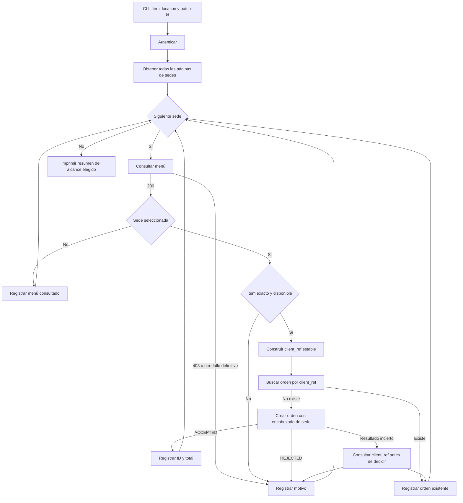
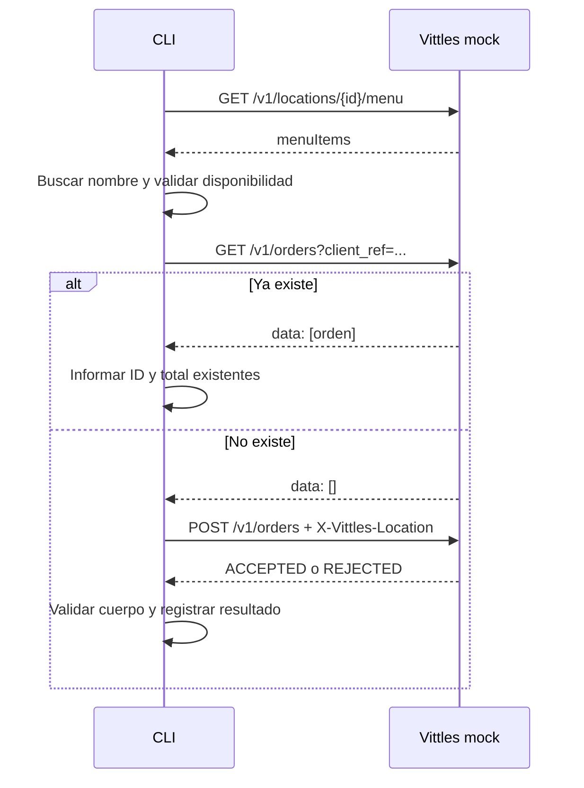
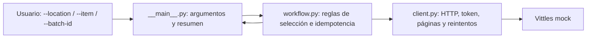

# Propuesta de solución — integración con Vittles POS

**Estado:** propuesta histórica previa al desarrollo. La decisión posterior del usuario fue Laravel 12 + Blade; consultar el [README actual](../README.md) para la implementación y los comandos vigentes.  
**Fuentes:** mail de la entrevista compartido por el candidato y `vittles-pos-api.zip` (`README.md`, `API_DOCS.md` y `mock_server.py`)  
**Objetivo:** construir una CLI pequeña que consulte todas las sedes y sus menús y cree **una sola orden**, de dos unidades del ítem pedido, **en la sede indicada por parámetro**. Debe poder ejecutarse dos veces seguidas sin duplicar esa orden.

## 1. Alcance y criterio de interpretación

La consigna principal, reiterada por el candidato, pide crear **una orden en la location pasada por parámetro**. El README del ZIP dice “una orden por location”; esa diferencia se documenta, pero **no se implementa un modo de órdenes masivas**. Ambos textos coinciden en autenticar, traer todas las sedes, intentar obtener sus menús, usar cantidad 2 y evitar duplicados.

La CLI exigirá `--location ID` y `--item NOMBRE`. Paginará las locations, intentará consultar el menú de **cada** una y solo considerará crear una orden para la sede seleccionada. Un menú `403` de otra sede se registrará como advertencia, sin impedir la orden elegida.

Para `Buffalo Wings (12)`, estos son resultados posibles **según la sede que se pase como parámetro**; una ejecución elige una sola fila:

| Sede indicada | Resultado esperado en la primera ejecución | Total esperado |
| --- | --- | ---: |
| Midtown (`loc_1001`) | Orden aceptada | USD 31.00 |
| Riverside (`loc_1002`) | Orden aceptada | USD 31.00 |
| Airport (`loc_1003`) | Orden aceptada | USD 32.50 |
| Warehouse (`loc_1004`) | Menú inaccesible: sede inactiva (`403`) | — |
| Beachside (`loc_1005`) | Ítem no disponible | — |

Con `--location loc_1001` se crearía **una sola orden** por USD 31.00; la segunda ejecución la mostraría como **ya existente** con el mismo ID y total. El precio de USD 15.50 se observó en el menú HTTP de esa sede; una creación de dos unidades devolvió USD 31.00.

## 2. Decisiones principales

| Tema | Propuesta | Motivo |
| --- | --- | --- |
| Forma de entrega | CLI en Python 3.9+ | Es el lenguaje del mock y permite una entrega autocontenida. |
| Dependencias | Solo biblioteca estándar | El ejercicio es pequeño y no requiere instalación adicional. |
| Configuración | `--item` y `--location ID` obligatorios; `--base-url` opcional; credenciales por variables de entorno; `--batch-id` opcional con valor estable de demostración | Mantiene el alcance de una sola orden y permite repetir el mismo comando. |
| Selección del ítem | Coincidencia exacta del nombre, tras quitar espacios externos; si hay más de una coincidencia, error explícito | Evita ordenar un producto parecido por accidente. |
| Monto | `Decimal` al leer precios y al mostrar totales; el total de la respuesta es la cifra autoritativa | El menú mezcla números y cadenas; el dinero no debe depender de `float` en el cliente. |
| Idempotencia | Referencia determinista por lote, sede, ítem y cantidad; consultar órdenes por `client_ref` antes de crear | El mock no aplica la idempotencia que prometen los docs. |
| Errores | Reintentos acotados para lecturas ante `429`/`500` y renovación única del token ante `401`; una creación incierta se verifica por `client_ref` antes de considerar cualquier reenvío | Evita fallos transitorios y reduce el riesgo de duplicados. |
| Ejecución | Secuencial | Cinco sedes no justifican concurrencia y se reduce la presión sobre el rate limit observado. |

### Opciones consideradas

1. **Python con biblioteca estándar (recomendada):** menor fricción para correr y defender cada línea.
2. Node.js con `fetch`: viable, pero añade una segunda plataforma sin aportar valor a este ejercicio.
3. Servicio web o base de datos: útil para una integración permanente y multiusuario; aumenta el alcance sin resolver mejor la prueba de dos ejecuciones consecutivas.

## 3. Comportamiento real que condiciona el diseño

La documentación del ZIP se usa como hipótesis y se contrasta con respuestas HTTP. Autenticación, paginación, `menuItems`, `403`, `REJECTED` y falta de deduplicación se comprobaron con solicitudes locales al mock:

| Área | Documentación | Mock / decisión propuesta |
| --- | --- | --- |
| Autenticación inicial | Dice que todas las solicitudes llevan bearer | `/oauth/token` acepta credenciales sin bearer; es la excepción necesaria para obtenerlo. |
| Token | `expires_in: 3600` | Devuelve `expires: 90`; leer ambos nombres y renovar por vencimiento o `401`. |
| Sedes | Una sola respuesta con todas | Páginas de dos elementos con `next_cursor`; continuar hasta que no haya cursor, detectando ciclos. |
| Menú | `menu_items` | Devuelve `menuItems`; aceptar ese campo y validar el formato. |
| Datos del menú | Precio decimal, disponibilidad booleana | Precio numérico o cadena; disponibilidad booleana o `0`/`1`; normalizar con validación. |
| Sede inactiva | No especificada | `GET menu` devuelve `403`; registrar el motivo en el resumen. |
| Creación | `201` o `400` | Puede devolver `200` con `status: REJECTED`; verificar estado del cuerpo, no solo HTTP. |
| Contexto de sede | No documentado | `POST /v1/orders` exige `X-Vittles-Location` igual a `location_id`. |
| Cliente en payload | El ejemplo de creación incluye `customer` | El POST de prueba se aceptó sin `customer`; no enviar datos personales ficticios sin necesidad. |
| `client_ref` | Repetirlo devuelve la misma orden | No hay deduplicación al crear; `GET /v1/orders?client_ref=...` permite buscar órdenes existentes. |
| Límite | 60/min, `Retry-After` en segundos | Se observó HTTP 429 con `Retry-After-Ms: 4000`; respetar ese encabezado. El cupo exacto queda por medir. |
| Tiempo | `created_at` UTC por sufijo `Z` | No se validó la zona horaria efectiva; no usar ese campo para idempotencia ni decisiones de negocio. |

El endpoint de consulta por `client_ref` está presente en el mock aunque no figure en `API_DOCS.md`. La solución del ejercicio dependerá de él; esa dependencia debe declararse en el README. En una API real, habría que confirmar su soporte y semántica con el proveedor.

## 4. Flujo funcional



### Secuencia de una sede elegible



## 5. Idempotencia y fallos

`client_ref` se construirá a partir de una versión de esquema, `batch-id`, ID de sede, nombre exacto normalizado del ítem y cantidad `2`, codificados de forma estable (por ejemplo, con SHA-256 y un prefijo legible). El ID de catálogo **no** formará parte de la referencia: podría cambiar entre dos ejecuciones de la misma intención. El `batch-id` predeterminado será fijo para la demostración, de modo que el mismo comando represente el mismo lote. Un `--batch-id` nuevo permitirá crear intencionalmente otro lote de órdenes. En producción, el sistema llamador debería entregar un ID de operación único y persistir la intención original.

Antes de cada `POST`, la CLI consultará `GET /v1/orders?client_ref=...`. Si encuentra una orden, informará su ID y total sin crear otra. Si encuentra varias, no creará ninguna y marcará la anomalía. Si se pierde la respuesta del `POST`, consultará de nuevo por la referencia antes de intentar otra acción. Los reintentos automáticos de `POST` quedan excluidos mientras no se pueda establecer si la orden se creó.

**Límite conocido:** esta estrategia satisface dos ejecuciones **consecutivas** contra el mismo proceso del mock. Dos procesos simultáneos podrían consultar a la vez y crear duplicados porque el servidor no garantiza unicidad. Si se pidiera concurrencia o persistencia entre reinicios del servidor, haría falta soporte de idempotencia del proveedor o una persistencia/coordinación externa.

El mock guarda las órdenes en memoria. Reiniciarlo borra las anteriores; la demostración de dos ejecuciones debe hacerse sin reiniciarlo.

## 6. Estructura propuesta del proyecto

```text
Proyecto_HeyT/
├── README.md                     # Uso exacto, decisiones (media página) y uso de IA
├── vittles_pos/
│   ├── __init__.py
│   ├── __main__.py                # Entrada CLI y salida/exit code
│   ├── client.py                  # HTTP, auth, límites, paginación
│   └── workflow.py                # Selección del ítem, referencia, órdenes y resumen
├── tests/
│   ├── test_workflow.py           # Casos críticos puros
│   └── test_mock_integration.py   # Dos ejecuciones contra el mock
├── reference/
│   ├── mock_server.py             # Copia del material provisto para reproducibilidad
│   └── API_DOCS.md
└── docs/
    └── PROPUESTA.md
```

La separación deja el acceso HTTP aislado de las reglas del ejercicio. Los archivos de `reference/` son material recibido, no código de producción.

## 7. Interfaz y salida propuestas

Comandos previstos para PowerShell, una vez implementado:

```powershell
py -3 reference/mock_server.py
```

En otra terminal:

```powershell
$env:VITTLES_CLIENT_ID = 'partner-demo'
$env:VITTLES_CLIENT_SECRET = '<valor-del-README-original>'
py -3 -m vittles_pos --location loc_1001 --item 'Buffalo Wings (12)'
py -3 -m vittles_pos --location loc_1001 --item 'Buffalo Wings (12)'
```

Los comandos son **propuestos**, aún no ejecutables porque la integración no está implementada. En esta máquina `python` no está en `PATH`, pero `py -3` sí funciona.

El resumen mostrará `resultado`, `orden_creada_en_esta_ejecución`, `order_id`, `total` y `motivo` **para la sede seleccionada**, además de un conteo de locations y menús consultados. `resultado` distinguirá `CREATED`, `EXISTING`, `SKIPPED`, `FAILED` y `UNKNOWN` (si no se puede establecer el efecto de una creación). Una sede inactiva o con el producto no disponible será `SKIPPED`; una falla técnica definitiva será `FAILED`. Un resultado `REJECTED` del servidor nunca se presentará como orden creada.

## 8. Verificación y criterios de aceptación

1. La consulta de sedes incluye las cinco, recorriendo tres páginas y sin omitir la inactiva.
2. Se intenta consultar el menú de cada sede; `403` queda registrado sin detener las restantes.
3. Los precios `15.5` y `"15.50"`, y las disponibilidades `true`, `1` y `0`, se interpretan correctamente.
4. Una respuesta `200` con `REJECTED` no se contabiliza como éxito.
5. Un `500` transitorio al leer menú y un `429` respetan los reintentos acotados; el token puede renovarse tras `401`.
6. Dos ejecuciones seguidas con `--location loc_1001` producen **una orden en total**, con el mismo ID y total.
7. La salida identifica la sede seleccionada y confirma que se descubrieron las cinco; informa si algún menú no pudo obtenerse.
8. El README final incluye el comando exacto, decisiones, exclusiones deliberadas y declaración del uso de IA.

## 9. Etapas de trabajo propuestas

1. **Validación exploratoria:** auth, paginación, menú, rechazo y falta de deduplicación ya se comprobaron con el mock; completar la matriz con fallos y tiempos límite.
2. **Cliente HTTP:** autenticación, lectura de respuestas, reintentos acotados, token y paginación.
3. **Reglas de negocio:** selección por nombre, disponibilidad, `client_ref`, búsqueda y creación.
4. **CLI y resumen:** opciones, códigos de salida y tabla por sede.
5. **Prueba de doble ejecución:** demostrar el resultado esperado con el mismo proceso del mock.
6. **Entrega:** README breve, lista de exclusiones y declaración de IA.

## 10. Fuera de alcance deliberado

- Interfaz gráfica, servicio desplegado o base de datos.
- Concurrencia entre procesos y garantía de idempotencia distribuida: el mock no la ofrece.
- Persistencia de órdenes más allá de la vida del mock.
- Sincronización continua de catálogos, manejo de zonas horarias o uso de `created_at`.
- Soporte de otros proveedores POS y abstracciones genéricas prematuras.

## 11. Interpretación del alcance

La implementación seguirá el mail reiterado por el candidato: **una orden únicamente en la sede indicada por `--location`**. El README del ZIP contiene otra formulación; se señalará brevemente como discrepancia de requisitos, sin añadir un modo masivo. Si la sede elegida está inactiva o el ítem no está disponible, se informará que no pudo crearse una orden válida.

## 12. Problemas posibles y respuesta prevista

Las primeras diez filas se desprenden del material entregado. Las últimas tres son límites importantes si el ejercicio se extendiera a producción.

| Problema | Consecuencia | Cómo lo resolveríamos | Cómo demostrarlo |
| --- | --- | --- | --- |
| La lista de sedes está paginada sin documentarlo | Se procesan solo dos de cinco sedes | Seguir `next_cursor` hasta agotarlo; detectar cursores repetidos y limitar páginas ante una API defectuosa | El descubrimiento contiene cinco sedes, incluida `loc_1005` |
| Una sede está inactiva y su menú devuelve `403` | El proceso podría detenerse o esconder esa sede | Registrar el menú inaccesible y continuar; si es la sede elegida, no crear | Ejecutar con `--location loc_1004` |
| El ítem falta o figura como no disponible | Orden rechazada o producto equivocado | Buscar el nombre exacto en el menú de la sede elegida, validar disponibilidad y no enviar `POST` si no cumple | Ejecutar con `--location loc_1005` y Buffalo Wings |
| El menú cambia de tipos y nombre de campo | Error al parsear o cálculo incorrecto | Adaptador en `client.py`: `menuItems`, precio convertido a `Decimal`, disponibilidad `bool` o `0`/`1`; rechazar datos desconocidos | Pruebas con `15.5`, `"15.50"`, `true`, `1`, `0` |
| El token vence en 90 segundos y el mensaje del `401` no es estable | Fallos a mitad de la corrida | Usar el tiempo de expiración recibido con margen y renovar una sola vez ante cualquier `401` de una ruta protegida | Prueba de token vencido o sustitución controlada de respuesta |
| `GET menu` falla a veces con `500` | Resultado intermitente | Reintentos limitados con espera creciente y pequeña variación; si se agotan, `FAILED` para esa sede y continuar | Ejecutar varias corridas o prueba con transporte simulado |
| El servidor devuelve `429` con `Retry-After-Ms` y aún no se midió el cupo exacto | `429` repetidos, posible bloqueo temporal | Flujo secuencial; respetar milisegundos del encabezado y admitir `Retry-After` estándar como alternativa | Captura HTTP en `BLACKBOX_AUDIT_EDGE.json` |
| Un `POST` responde `200` con `REJECTED` | Falso éxito si solo se mira el código HTTP | Validar `status == ACCEPTED`, `id` y `total`; registrar el motivo del rechazo | Prueba de orden sin encabezado de sede |
| `client_ref` no deduplica en el servidor | Dos ejecuciones crean dos órdenes | Referencia estable + búsqueda previa por `client_ref`; nunca asumir que repetir `POST` es seguro | Dos corridas con `--location loc_1001` sin reiniciar el mock: una sola orden |
| La respuesta a `POST` se pierde después de que el servidor creó la orden | Un reintento ciego la duplicaría | Tratar el resultado como incierto; consultar por `client_ref` antes de decidir. Si la consulta falla, informar `FAILED/UNKNOWN` sin volver a crear | Prueba con transporte que simule corte después de enviar |
| Dos procesos corren simultáneamente | Ambos pueden ver que no existe y crearla | Documentar el límite; para producción exigir idempotencia real del servidor o coordinación transaccional externa | Prueba concurrente solo si el alcance cambia |
| El mock se reinicia entre corridas | Desaparecen las órdenes en memoria | Mantener vivo el mismo proceso para la demostración; para producción, almacenamiento duradero del proveedor | Instrucciones exactas en README |
| La API real devuelve una búsqueda retrasada o incompleta | Una consulta vacía podría preceder a una duplicación | Acordar con el proveedor consistencia e idempotencia del endpoint; ante incertidumbre, detener la creación y pedir conciliación | Contrato/API de producción, fuera del mock |

### Regla ante resultados inciertos

La regla operativa es **no volver a enviar una orden cuando no sabemos si el primer envío fue aceptado**. Primero se consulta la referencia. Si no se puede verificar, el resumen indicará `UNKNOWN` o `FAILED` según la causa y el programa saldrá con error. Es preferible una orden pendiente de conciliación que una duplicada.

## 13. Oportunidades para destacar sin sobrediseñar

| Prioridad | Mejora | Qué demuestra | Costo aproximado |
| --- | --- | --- | --- |
| Alta | **Matriz “docs vs comportamiento” con una decisión por diferencia** | Capacidad de investigar un contrato imperfecto y justificar adaptaciones | Muy bajo; ya está en esta propuesta |
| Alta | **Prueba demostrable de dos ejecuciones** que compruebe ID igual y una sola orden para `--location` | Idempotencia comprobada, no solo declarada | Bajo |
| Alta | **Conciliación después de un `POST` incierto** | Entender que las fallas de red ocurren después de que el servidor puede haber actuado | Bajo a medio |
| Alta | **Resumen útil para operar**: resultado claro de la sede indicada y conteo de menús consultados | Facilita detectar problemas sin revisar logs | Bajo |
| Media | **`--dry-run`** que consulte sedes y menús y muestre qué órdenes se crearían, sin enviar `POST` | Permite revisar el impacto antes de ejecutar | Bajo |
| Media | **Salida `--json` opcional** además de la tabla humana | Facilita evaluación automática e integración posterior | Bajo |
| Media | **Logs de diagnóstico con `--verbose`**, sin tokens ni secretos | Hace trazables reintentos, renovación y referencias | Bajo |

La mejor señal sería mostrar un caso difícil reproducible, explicar la decisión y enseñar una prueba que lo verifica. `--dry-run`, `--json` y `--verbose` son mejoras opcionales; no deben retrasar los entregables obligatorios.

## 14. Guion sencillo para explicar el sistema

### Versión de 30 segundos

> “La herramienta recibe un producto y una sede, se autentica, pagina todas las sedes y consulta sus menús. En la sede elegida verifica el producto y busca una orden previa de este lote. Si existe, informa su ID y total; si no, crea una orden de dos unidades. Solo esa sede puede recibir una orden.”

### Versión de dos minutos

1. **Entrada:** `--item` identifica el producto, `--location` la sede y `--batch-id` la intención de compra. Repetir esos datos significa repetir el mismo lote.
2. **Descubrimiento:** el cliente obtiene token y recorre las páginas de sedes. Después solicita el menú de cada una.
3. **Validación:** en la sede seleccionada, el flujo exige coincidencia exacta del nombre, disponibilidad y datos válidos. Así evita enviar órdenes que el POS rechazará.
4. **Protección contra duplicados:** calcula un `client_ref` estable por sede/producto/lote y consulta si ya hay una orden. Solo crea si la búsqueda confirma que no existe.
5. **Respuesta:** acepta una orden únicamente cuando el cuerpo dice `ACCEPTED` y trae ID y total. El resumen indica qué se creó, qué ya existía y qué no fue posible.
6. **Fallos:** lecturas transitorias se reintentan; una creación de resultado incierto se concilia por `client_ref` antes de cualquier otra acción.

### Mapa de construcción



`client.py` responde **cómo hablar con Vittles**; `workflow.py` responde **cuándo crear una orden**; `__main__.py` responde **cómo usa y entiende el resultado una persona**. Esa separación permite probar las decisiones de negocio sin depender de la red.

## 15. Preguntas probables y respuestas defendibles

| Pregunta | Respuesta breve |
| --- | --- |
| **¿Por qué una orden y no cinco?** | La consigna principal pide una orden en la sede recibida por parámetro; traer todas las sedes y menús es una lectura previa, no una instrucción de ordenar en todas. |
| **¿Qué pasa si la sede elegida no permite ordenar?** | Se informa `SKIPPED` con el motivo; por ejemplo, `loc_1004` no expone menú y Buffalo Wings no está disponible en `loc_1005`. |
| **¿Por qué no confiaste en `API_DOCS.md`?** | Se empezó con los docs y se contrastaron con el mock, que el enunciado declara fuente de verdad. Cada diferencia quedó registrada con una adaptación concreta. |
| **¿Cómo evitás duplicados?** | `client_ref` estable por lote/sede/ítem/cantidad más búsqueda antes del `POST`. La segunda ejecución encuentra las órdenes y reutiliza su ID y total. |
| **¿Es una garantía absoluta de idempotencia?** | No. Cubre ejecuciones consecutivas contra este mock. La API no impone unicidad, así que procesos simultáneos necesitan soporte del servidor o coordinación externa. |
| **¿Qué pasa si el `POST` se procesó pero la conexión se cortó?** | No lo repito a ciegas. Busco el `client_ref`; si no puedo conciliarlo, reporto resultado incierto y salgo con error. |
| **¿Para qué sirve `--batch-id`?** | Distingue la repetición del mismo lote de una nueva intención de compra. El valor por defecto permite demostrar dos ejecuciones sin duplicados; cambiarlo habilita un lote nuevo. |
| **¿Por qué buscar el ítem por nombre en cada sede?** | El usuario lo da por nombre y el menú puede diferir por sede; se obtiene el ID correcto de cada menú. Una coincidencia ambigua o ausencia se informa y no se adivina. |
| **¿Por qué `Decimal`?** | Los precios llegan como números o cadenas y son dinero. `Decimal` evita errores de representación en cálculos y presentación; el total devuelto por el POS sigue siendo el valor final. |
| **¿Cómo tratás los `200` de rechazo?** | El estado HTTP no basta: el cuerpo debe decir `ACCEPTED` y contener ID y total. `REJECTED` se registra con su razón. |
| **¿Qué hacés con un `401`?** | Renuevo el token una vez y repito la operación protegida; si persiste, informo un fallo de autenticación. No dependo del texto variable del error. |
| **¿Qué hacés con `429` y `500`?** | En lecturas, reintentos acotados y espera indicada por `Retry-After-Ms` o el encabezado estándar. En creación, primero determino si hubo efecto antes de considerar otra acción. |
| **¿Por qué Python sin dependencias?** | Satisface el alcance con un entorno similar al del mock, simplifica el comando de ejecución y deja visible la lógica importante. |
| **¿Por qué no agregaste una base de datos?** | El ejercicio exige dos corridas consecutivas y el mock expone una búsqueda por referencia; una base local no solucionaría por sí sola la carrera entre procesos ni el estado real del POS. |
| **¿Cómo lo probaste?** | Ya se verificó el comportamiento básico del mock. La aceptación prevista para el código combina casos de parsing/fallos con dos ejecuciones contra el mismo proceso: una sola orden persistida en modo `--location`. |
| **¿Qué hiciste con IA?** | Se declarará de forma concreta en el README: ayuda para analizar el contrato, diseñar y revisar la solución; cada decisión y línea del código final deberán poder explicarse y verificarse. |

## 16. Orden recomendado para la defensa

1. Mostrar el comando con `--location loc_1001` y el resumen de la **primera** ejecución.
2. Repetirlo y mostrar **el mismo ID**, sin una segunda orden.
3. Mencionar en una frase la discrepancia mail/README y explicar que el comando sigue la consigna principal: una sola sede.
4. Mostrar una diferencia decisiva entre docs y mock: repetir `client_ref` sí duplica en el servidor.
5. Recorrer los tres módulos del mapa y una prueba representativa.
6. Cerrar con el límite real: la simultaneidad requiere idempotencia del proveedor o coordinación adicional.

## 17. Decisiones que faltan cerrar antes del código

1. **Alcance:** queda fijado por la consigna reiterada: `--location ID` obligatorio y una sola orden posible por ejecución. Documentar la discrepancia del README sin extender el programa.
2. **Identidad de una intención:** el mismo `batch-id` y los mismos argumentos significan reintento; un lote nuevo exige otro `batch-id`. El valor demo fijo es práctico para el ejercicio, pero no sirve como identificador de pedidos reales.
3. **Salida del proceso:** proponer `0` cuando la orden de la sede seleccionada fue creada o ya existía, `2` para entrada inválida o imposibilidad de negocio, `3` para fallo técnico/contrato y `4` para resultado incierto.
4. **Entorno de demostración:** verificar `py -3`, arrancar un mock fresco y ejecutar dos veces **sin reiniciarlo**. Evitar ráfagas de pruebas exploratorias inmediatamente antes de la demo: se observó HTTP 429 con `Retry-After-Ms: 4000`, pero el cupo exacto y su alcance quedan por medir.
5. **Entrega administrativa:** el mail también pide una fecha realista y tres opciones de día/rango horario para la entrevista. Eso no es parte del código, pero debe contestarse al remitente.
