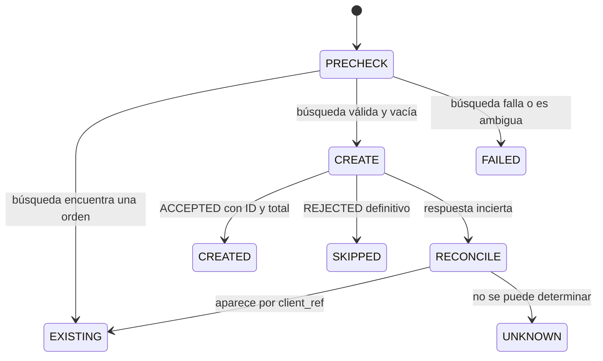
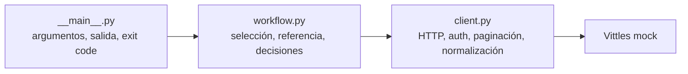

# Revisión crítica y guía para defender la integración Vittles

**Estado:** análisis previo al desarrollo. Complementa [la propuesta](PROPUESTA.md).  
**Fuentes recibidas:** mail de la entrevista (copiado por el candidato), `README.md`, `API_DOCS.md` y `mock_server.py` del ZIP. No se dispone de una API de producción.  
**Evidencia adicional:** se levantó temporalmente el mock y se comprobaron respuestas reales sin modificarlo; se detuvo al terminar. No se ha escrito la integración.

## 1. Requerimientos, ambigüedades y fuente de verdad

| Tema | Mail | README del ZIP | Resolución propuesta |
| --- | --- | --- | --- |
| Alcance de creación | Una orden **en la location pasada por parámetro** | Una orden **por location** | El candidato reiteró que trabajemos sobre la consigna del mail: `--location ID` obligatorio, una sola orden posible por ejecución. Documentar la discrepancia, sin modo masivo. |
| Lecturas | Todas las locations y menú de cada una | Igual | Paginar todas e intentar cada menú. Un `403` impide obtener el menú inactivo; se informa, no se finge éxito. |
| Producto | Por nombre, cantidad 2 | Igual | Nombre exacto en el menú de la sede elegida; cantidad fija 2. |
| Doble ejecución | Sin duplicados | Igual | Misma intención (`batch-id`, sede, producto) reutiliza orden existente. |
| Resumen | Si se creó, ID y total | Por location, creación, ID y total | Resultado de la sede elegida y conteo de lecturas. Distinguir `CREATED` de `EXISTING`. |
| Entrega | Código, README de media página y lista de exclusiones; declarar IA | Igual | Esos entregables son obligatorios. El mail pide además responder fecha estimada y tres opciones horarias: es coordinación, no parte del software. |

**Jerarquía práctica:** la petición actual del candidato determina que ahora hacemos diseño y análisis, no desarrollo, y reitera expresamente el alcance del mail. El README tiene una formulación diferente, que se registra sin ampliar la implementación. Para el contrato técnico del ejercicio, el comportamiento ejecutado del mock gana sobre `API_DOCS.md`, como ambos enunciados indican. El código fuente ayuda a investigar, pero una prueba de respuesta confirma lo que verá el cliente. En producción no se tomaría un mock como contrato de la API real.

**No asumir sin verificar:** que `client_ref` deduplica, que una respuesta `2xx` significa orden creada, que hay una sola página, que `available` siempre es booleano, que precio siempre es número, que el token dura una hora, que `created_at` representa UTC, que existe un menú accesible para todas las sedes, que el producto tiene el mismo ID/precio/disponibilidad en todas, o que una consulta vacía garantiza que nunca hubo una orden.

**Evidencia de ejecución ya obtenida:** el token trae `expires: 90`; locations llegan en páginas de `2, 2, 1`; el menú trae `menuItems`; la sede inactiva devuelve `403`; crear sin `X-Vittles-Location` da `200` + `REJECTED`; dos `POST` con el mismo `client_ref` produjeron `ord_5501` y `ord_5502`; la búsqueda por esa referencia devolvió **dos** órdenes. Estas pruebas se hicieron en un proceso temporal y no son datos persistentes del proyecto.

La diferencia de alcance se puede mencionar en la defensa en una frase: “Seguí el mail: consulto todas las sedes y menús, pero creo únicamente en la sede indicada”.

## 2. Casos límite y reglas de negocio

| Caso | Conducta propuesta |
| --- | --- |
| No hay locations | No hacer `POST`; error claro “no se encontró la sede solicitada” y conteos en cero. |
| La sede solicitada no existe | Error de entrada (`location_id` desconocido), listar IDs válidos sin adivinar. |
| Location inactiva o menú `403` | Registrar que el menú es inaccesible; si es la sede elegida, no crear y devolver resultado de negocio `SKIPPED`. |
| Producto no existe | No enviar orden; mostrar nombre buscado y, opcionalmente, sugerencias **solo informativas** del mismo menú. |
| Producto agotado/no disponible | No enviar orden, informar `SKIPPED: unavailable`. |
| Nombres parecidos | Coincidencia exacta tras recortar espacios externos; no usar fuzzy matching para decidir una compra. Si hay dos coincidencias exactas en el mismo menú, marcar ambigüedad. |
| Precio diferente por sede | Usar el ítem de esa sede. No transportar precio ni ID desde otra. El POS determina el total final. |
| Respuesta vacía, JSON inválido o campos críticos ausentes | No sustituir por valores inventados. Registrar error de contrato; no crear si no se validó el menú o la búsqueda previa. |
| Tipos inesperados | Aceptar solo variaciones observadas: precio numérico o decimal en cadena, disponibilidad booleana o entero `0`/`1`. Rechazar `"yes"`, `null`, precios no finitos o IDs vacíos. |
| Menú falla en una sede no seleccionada | Continuar el descubrimiento y mostrar advertencia. Si falla la sede seleccionada, no crear allí. |

Para una sede elegible, la validación del menú es obligatoria aunque el servidor vuelva a validar la orden. Evita enviar una orden evidentemente inválida y confirma que el `item_id` pertenece a esa location. Esta validación no elimina una carrera si el menú cambia entre el `GET` y el `POST`: un rechazo del POS sigue siendo posible y debe mostrarse.

## 3. Fallos externos y política de reintentos

**Presupuesto propuesto:** timeout de conexión y de lectura, como valores configurables; máximo de 3 intentos para lecturas transitorias; espera creciente con pequeña variación y límite total de tiempo. Los valores exactos se fijarán durante implementación y quedarán documentados. El objetivo es no bloquear indefinidamente ni bombardear al proveedor.

| Situación | ¿Reintentar? | Regla |
| --- | --- | --- |
| Vittles caído o conexión rechazada en un `GET` | Sí, acotado | Si se agota el presupuesto, error técnico claro; no crear. |
| Respuesta lenta en `GET` | Sí, acotado | Timeout explícito; cada intento consume el presupuesto. |
| `500` en lectura | Sí, acotado | Espera creciente. Guardar `trace_id` si existe. |
| `429` | Sí, después de esperar | Priorizar `Retry-After-Ms` observado; admitir `Retry-After` estándar; límite total de espera. |
| `401` en ruta protegida | Una vez | Renovar token y repetir. Si persiste, error de auth. |
| `400`, `403`, `404`, `REJECTED` | No | Son resultado definitivo o error de contrato/entrada para esa operación. |
| Timeout o corte **después de enviar `POST`** | No repetir a ciegas | Consultar `client_ref`; si no se puede conciliar, `UNKNOWN`. |
| `500` al crear | No repetir a ciegas | La respuesta no prueba que no haya efecto; conciliar por referencia. |
| `429` o `401` explícito al crear | Puede repetirse tras corregir la condición | En el mock el rechazo ocurre antes de procesar el cuerpo; aun así, mantener la política conservadora y validar el resultado. |

Una caída general no debe transformarse en cinco veces más tráfico por cada sede. Los reintentos son secuenciales, acotados y observables. Para 5.000 sedes haría falta un limitador de tasa compartido, presupuesto de errores y posiblemente circuit breaker; para cinco, eso sería excesivo.

## 4. Idempotencia, consistencia y estados inciertos

**“No duplicar”** significa que repetir la **misma intención** con los mismos `batch-id`, sede, ítem y cantidad no produce un segundo efecto de creación. No significa que nunca se puedan hacer dos compras iguales: otro `batch-id` expresa una nueva intención.

El cliente genera un `client_ref` determinista con `batch-id`, sede, nombre exacto normalizado y cantidad; **no incluye el ID mutable del catálogo**. Luego busca `GET /v1/orders?client_ref=...` y solo crea si obtiene una respuesta válida y vacía. Si encuentra una orden, devuelve `EXISTING`; si encuentra varias, informa duplicados existentes y **no crea otra**. Si la búsqueda falla, tampoco crea. Después de un `POST` incierto vuelve a consultar. Una orden `ACCEPTED` con ID pero sin total también exige consulta de conciliación; no puede presentarse como éxito completo ni reenviarse.

El valor predeterminado de `batch-id` será fijo **solo para la demostración**. De otro modo, dos ejecuciones del mismo comando no podrían reconocerse como la misma intención. En un sistema real el llamador debe proporcionar un ID de operación único para cada compra nueva y conservarlo para sus reintentos; usar siempre el valor demo haría que compras legítimas posteriores se confundieran con la primera.

**Garantía honesta:** esto evita duplicados en las dos ejecuciones secuenciales pedidas **mientras el mismo mock siga vivo**. No ofrece *exactly once* general. Hay una carrera entre “buscar” y “crear” si dos procesos usan el mismo `client_ref`. Además, las órdenes del mock desaparecen al reiniciarlo. Una búsqueda eventualmente consistente en una API real podría devolver vacío aunque el primer `POST` sí se haya procesado.

**Solución correcta del lado del proveedor:** una clave de idempotencia persistida con restricción única por partner y referencia, aplicada atómicamente con la creación; comparar también un hash del payload y responder conflicto si se reutiliza la clave para otra intención; devolver la misma orden para el mismo pedido; exponer consulta por referencia y una retención definida. El cliente conserva un estado `UNKNOWN` y un proceso de conciliación cuando la respuesta se pierde. Una base de datos local sola no puede garantizar el efecto remoto.



`UNKNOWN` significa “puede existir una orden”; no es sinónimo de “no creada”. Debe salir con código no exitoso, incluir sede y referencia de conciliación y pedir revisión antes de una nueva intención. No tomar una decisión irreversible basándose en ausencia de respuesta.

## 5. Integridad de datos y contrato de API

El **menú de la sede** es la fuente para identificar el producto y su disponibilidad previa. El **POS** es la fuente del estado y total de una orden aceptada. El cliente puede calcular `precio × 2` con `Decimal(str(precio))` como estimación o control diagnóstico, pero no reemplaza el total del POS: podrían existir impuestos, descuentos o recargos no incluidos en el menú. En el mock, el total esperado para `loc_1001` es USD 31.00.

El adaptador de Vittles normaliza diferencias conocidas (`menuItems`, `expires`, `0`/`1`, `Retry-After-Ms`) y conserva un modelo interno uniforme. **Tolerancia limitada:** aceptar formatos comprobados y validar campos críticos; no aceptar cualquier estructura “por si acaso”. Un `menuItems` ausente, `next_cursor` cíclico, una orden `ACCEPTED` sin ID o un total inválido son errores de contrato y deben fallar visiblemente. Un cambio incompatible de ruta, semántica de `client_ref`, campos obligatorios o estado de orden es un *breaking change* para esta integración.

La fecha `created_at` no se usa para decidir nada porque el mock coloca sufijo `Z` sobre hora local. Si hiciera falta fecha operativa, habría que corregir el contrato o usar una marca temporal inequívoca como `updated` con unidad documentada.

## 6. Seguridad y observabilidad

| Pregunta | Decisión para el ejercicio | Si fuera producción |
| --- | --- | --- |
| ¿Dónde viven las credenciales? | Variables de entorno; el README muestra valores demo del mock. No se reciben por CLI para evitar historial de comandos. | Secret manager, rotación y permisos mínimos. |
| ¿Qué no se registra? | `client_secret`, bearer token, encabezado Authorization, datos de cliente, cuerpos completos de pedidos. | Redacción automática y política de retención/acceso. |
| ¿Cómo evitar subir secretos? | `.gitignore` para `.env` y archivos locales; revisar cambios antes de entregar. No copiar tokens a README o tests. | Escaneo de secretos en CI y credenciales por ambiente. |
| ¿Qué pasa con token vencido? | Renovación única ante `401`; no confiar en el texto del error. | Métrica de renovación y alerta ante fallos persistentes. |
| ¿Qué se registra para depurar? | `run_id`, `client_ref` o versión abreviada, sede, endpoint sin secretos, intento, duración, código HTTP, resultado y `trace_id` del proveedor. | Logs estructurados, métricas y correlación distribuida. |

Los errores deben distinguir origen: `INPUT` (parámetro inválido), `BUSINESS` (producto no disponible o `REJECTED`), `AUTH`, `TRANSIENT_PROVIDER`, `CONTRACT` y `UNKNOWN_OUTCOME`. El resumen no necesita exponer detalles internos; `--verbose` opcional puede explicar reintentos y correlaciones. Con `run_id` + `client_ref` + ID/trace del proveedor se puede reconstruir lo ocurrido sin repetir el `POST`.

El mock usa HTTP local, razonable para el ejercicio. Producción requeriría HTTPS, almacenamiento de secretos, control de acceso, auditoría y tratamiento explícito de datos personales.

## 7. Experiencia de uso y contrato con un sistema llamador

El primer uso debería mostrar `--help` claro, ejemplo de comando para Windows (`py -3`) y errores que mencionen el argumento incorrecto y la siguiente acción. `--location` debería aceptar **ID**, no un nombre ambiguo. Si la sede o el ítem no se encuentran, se pueden mostrar alternativas válidas sin seleccionarlas automáticamente.

La salida humana debe destacar: sede, producto, cantidad, `CREATED` o `EXISTING`, `order_id`, total y motivo si no hubo orden. Un formato JSON opcional sirve a otra aplicación. Esquema mínimo propuesto:

```json
{
  "location_id": "loc_1001",
  "result": "EXISTING",
  "created_now": false,
  "order_id": "ord_5501",
  "total": "31.00",
  "reason": null
}
```

Los estados `CREATED`, `EXISTING`, `SKIPPED`, `FAILED` y `UNKNOWN` deben permanecer distintos para que otro sistema no vuelva a crear por interpretar un error como ausencia de orden. Los importes van como cadena decimal en JSON para no reintroducir imprecisión.

## 8. Diseño interno, simplicidad y mantenibilidad



- `__main__.py`: recibe parámetros, valida el modo y presenta el resultado; no interpreta JSON de Vittles.
- `workflow.py`: decide cuándo una orden es elegible, existente, creada o incierta; no arma encabezados HTTP.
- `client.py`: conoce rutas, headers, tokens, reintentos y diferencias documentadas del proveedor; concentra lo que cambiaría ante otra versión de Vittles.
- `tests/`: comprueba reglas y contratos riesgosos; no reproduce línea por línea la implementación.

La solución mínima correcta son esos tres módulos, un README breve, exclusiones y pruebas esenciales. Un framework web, ORM, cola, base de datos, sistema de plugins o jerarquía extensa de clases serían exceso para cinco sedes y una CLI. Las constantes no obvias (cantidad `2`, reintentos, timeout, `batch-id` demo) deben tener nombres y explicación, no números mágicos esparcidos.

Un desarrollador nuevo debería entender el flujo en diez minutos leyendo README, el diagrama y `workflow.py`. Se prefiere una función de normalización por respuesta externa a duplicar tolerancias en varios módulos.

## 9. Testing: qué probar y cómo

| Nivel | Pruebas que sí aportan | Método |
| --- | --- | --- |
| Reglas puras | Referencia estable, selección exacta, ambigüedad, disponibilidad, `Decimal`, estados | Datos en memoria, sin servidor. |
| Cliente/contrato | Tres páginas, `menuItems`, `expires`, `401`, `429` con milisegundos, `500`, JSON roto, `200 REJECTED`, múltiples resultados por `client_ref` | Transporte inyectable o servidor de pruebas controlado. |
| Integración con el mock entregado | Auth, cinco sedes, menú inaccesible, una creación en `loc_1001` y segunda corrida con mismo ID y total | Proceso nuevo del mock; correr dos veces **sin reiniciarlo entre ellas**. |
| Fallos aleatorios | Reintentos de `500` sin depender de una secuencia de suerte | Transporte simulado que devuelve `500` y luego `200`; la prueba real solo valida el camino completo. |
| Resultado incierto | Simular que el `POST` llega al servidor pero el cliente pierde la respuesta | Doble de transporte que permite consultar `client_ref` luego; verificar que nunca repite `POST` a ciegas. |

El generador aleatorio del mock tiene semilla fija, pero comparte estado entre peticiones. No conviene escribir tests que dependan del número exacto de llamada en que aparecerá un `500`: otras pruebas o un cliente paralelo cambiarían la secuencia. Los fallos se fuerzan en un doble controlado y se deja una prueba de integración contra el mock intacto.

## 10. Performance, concurrencia y crecimiento

Para `Buffalo Wings (12)` en `loc_1001`, sin reintentos: autenticación `1` + páginas de sedes `3` + menús `5` + búsqueda `1` + creación `1` = **11 requests** en la primera corrida; la segunda hace **10**. Dos corridas seguidas consumen **21** de las **30** solicitudes permitidas en una ventana de un minuto; fallos aleatorios con reintentos o solicitudes ajenas aún pueden disparar `429`.

El `Retry-After-Ms: 4000` del mock indica una espera inicial, **no asegura** que una ventana móvil de 60 segundos ya tenga cupo. Tras otro `429`, el cliente debe volver a esperar dentro de un presupuesto total; la demo debería comenzar con un mock fresco y no mezclar solicitudes exploratorias con las dos corridas que prueban idempotencia.

Con cinco sedes, consultar menús secuencialmente simplifica orden, trazabilidad y límite de tasa. Un caché puede dejar datos de disponibilidad obsoletos y no aporta mucho aquí. Con 5.000 sedes, la paginación de dos elementos implicaría unas 2.500 solicitudes solo para descubrirlas y 5.000 más para menús: el diseño operativo necesitaría paginación configurable, procesamiento por lotes, límite de concurrencia y tasa, persistencia de avance y quizá cambios incrementales del proveedor. Menús de miles de ítems exigirían paginación propia o filtrado del lado de Vittles. La separación actual permitiría cambiar `client.py` y el orquestador sin reescribir la CLI.

La carrera entre buscar y crear se resuelve verdaderamente en Vittles, mediante unicidad atómica por `client_ref`. Un lock local solo coordina procesos en la misma máquina y no alcanza si hay varias instancias o servidores.

## 11. Mejoras pequeñas con mucho impacto

1. **Detectar la contradicción mail/README y seguir el alcance reiterado por el candidato:** muestra lectura cuidadosa y evita crear órdenes adicionales.
2. **Mostrar `CREATED` versus `EXISTING` y `UNKNOWN`**: evita que un operador interprete “no tengo respuesta” como “podés reintentar”.
3. **Conciliar el `POST` incierto** por referencia: resuelve el fallo típico de integraciones que más fácilmente causa cobros u órdenes duplicadas.
4. **Comprobar con dos corridas e IDs iguales**: evidencia la propiedad pedida, en vez de confiar en una afirmación del README.
5. **Documentar diferencias observadas con una respuesta cada una**: una tabla de contrato pequeña comunica criterio mejor que muchas capas de abstracción.

`--dry-run` puede ser útil, pero debe etiquetarse como **vista previa**: el menú puede cambiar antes de la creación real. `--json` y `--verbose` son opcionales. La mejora más fuerte es hacer el comportamiento más seguro y verificable, no multiplicar funcionalidades.

## 12. Producción: qué cambiaría y qué no agregaría ahora

| Necesidad | En producción | En este ejercicio |
| --- | --- | --- |
| Idempotencia | Soporte atómico del POS y conciliación duradera | Búsqueda previa, límite de concurrencia documentado |
| Secretos | Secret manager, rotación, HTTPS | Variables de entorno y mock local |
| Operación | Métricas de éxito/rechazo/latencia/reintentos, alertas, trazas | Resumen claro y logs opcionales |
| Resiliencia | Rate limiter compartido, circuit breaker, cola si el volumen lo pide | Reintentos limitados secuenciales |
| Estado | Persistencia de intención y resultado incierto, auditoría | `client_ref` determinista y consulta al mock vivo |
| Calidad | Sandbox/staging, tests de contrato y migración de versiones | Tests de unidad y del mock provisto |

No pondría una cola, base de datos ni circuit breaker en la entrega chica sin una necesidad demostrada. Sí diseñaría los límites de módulos para poder agregarlos después.

## 13. Demo y defensa en tres duraciones

**20 segundos:** “Traigo sedes y menús, valido el ítem en la sede elegida y busco una orden previa antes de crearla. La segunda corrida reutiliza el mismo ID. Informo claramente si se creó, ya existía o quedó incierta.”

**Un minuto:** añadir que mail y README difieren en el alcance y que se siguió el mail. Mostrar primera y segunda corrida, ID igual y total. Señalar `200 REJECTED` y `client_ref` como ejemplos de diferencias entre docs y mock.

**Cinco minutos:** recorrer las tres cajas (`CLI`, `workflow`, `client`), la tabla de contrato y una prueba de timeout/conciliación. Cerrar con la limitación: dos procesos concurrentes no quedan protegidos por una búsqueda previa; la solución real debe estar en Vittles.

**Demo sugerida:** primero `py -3 -m vittles_pos --location loc_1001 --item 'Buffalo Wings (12)'`, luego el mismo comando; comparar ID y `created_now`. Para provocar un error interesante sin alterar datos, usar una sede inexistente o pasar `--location loc_1005` con Buffalo Wings. El test de `200 REJECTED` se muestra como prueba controlada, no como error accidental durante la demo.

## 14. Objeciones de un senior y respuestas honestas

| Objeción | Respuesta defendible |
| --- | --- |
| “¿Eso realmente es idempotente?” | Es idempotente para repeticiones secuenciales contra el mismo mock; no afirmamos una garantía concurrente ni persistente entre reinicios. |
| “¿Qué pasa con dos procesos?” | Hay una carrera entre consulta y creación. La unicidad debe imponerse atómicamente en el POS. |
| “¿Y después de un timeout del POST?” | Estado incierto; buscar referencia. Si no se puede conciliar, `UNKNOWN` y ningún reenvío ciego. |
| “¿Por qué confiás en `GET orders?client_ref`?” | Está implementado y se comprobó en el mock, aunque no está documentado. Es una dependencia declarada, no una garantía extrapolable a producción. |
| “¿Qué pasa si cambia mañana?” | El contrato de Vittles está concentrado en `client.py`; un test de contrato detecta cambios incompatibles. |
| “¿Por qué no hiciste fuzzy matching?” | Porque una compra equivocada es peor que pedir al usuario un nombre exacto; las sugerencias no deciden por él. |
| “¿Por qué no una base de datos?” | No resuelve por sí sola la atomicidad con el POS y aumenta el alcance de esta CLI. |
| “¿Cómo probarías sin el mock?” | Transporte simulado para fallos y respuestas; pruebas de contrato en un sandbox del proveedor antes de producción. |
| “¿Qué decisión cambiarías?” | La dependencia del endpoint de búsqueda no documentado: pediría soporte oficial de idempotencia y búsqueda por referencia. |
| “¿Qué deuda aceptás?” | Sin coordinación concurrente ni persistencia duradera de estados inciertos; están fuera de la garantía pedida y quedan explícitas. |

La discrepancia más discutible es el README que pide una orden por sede. La respuesta es concreta: el mail reiterado por el candidato pide `--location` y una sola orden; consultar todas las sedes y menús sigue siendo obligatorio. La decisión técnica que vale defender con firmeza es **no repetir un `POST` cuyo efecto se desconoce**.

## 15. Si fuéramos Vittles: mejoras al proveedor

- Hacer `client_ref` realmente idempotente con restricción única atómica y retención definida; devolver la misma orden al repetir exactamente el payload y `409 Conflict` si la referencia se reutiliza para otro pedido.
- Documentar oficialmente `GET /v1/orders?client_ref=...` o un endpoint equivalente de conciliación, incluyendo consistencia y paginación si puede haber varios resultados.
- Responder `400`/`422` a payload inválido, `403` a sede sin acceso y `201` solo cuando se crea. Evitar `200 REJECTED` como señal principal.
- Documentar `X-Vittles-Location`, `next_cursor`, tamaño de página, `menuItems`, `expires`, tipos de precio/disponibilidad y `Retry-After-Ms` o migrar al estándar `Retry-After`.
- Emitir marcas temporales UTC reales, IDs de solicitud estables en todos los errores, y un esquema de error consistente.
- Aclarar si la tasa es global, por partner o por token y ofrecer un sandbox predecible.

## 16. Qué comunica el trabajo del candidato

La revisión del mail contra el README demuestra lectura de requerimientos; las solicitudes al mock demuestran comprobación del contrato; la conciliación y el estado `UNKNOWN` muestran criterio sobre efectos remotos; la CLI de tres módulos y las exclusiones muestran control del alcance. La declaración de IA debe ser concreta y honesta. En la defensa hay que poder explicar personalmente la referencia determinista, el punto donde ocurre la carrera, la política de reintentos, el parseo de respuestas y por qué cada `POST` es seguro o se detiene.
